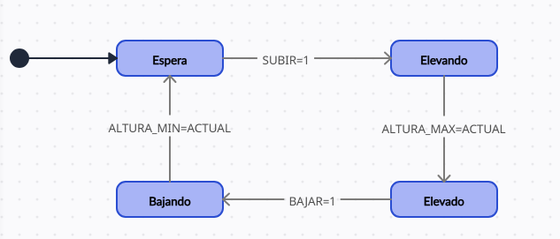
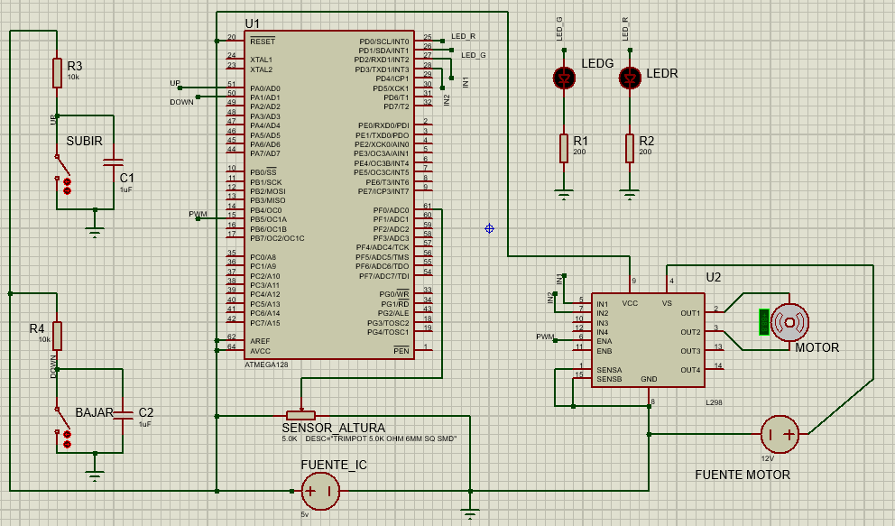

# Sistema controlador para puente levadizo

## Memoria descriptiva

El sistema de control del puente levadizo simula el funcionamiento de un puente que puede elevarse y bajarse para permitir el paso de embarcaciones y vehículos. El sistema opera a través de una máquina de estados que gestiona las transiciones entre cuatro estados principales: Espera, Elevando, Elevado y Bajando.

### Estado Inicial: Espera
En este estado, el sistema está en reposo, a la espera de una señal para iniciar el movimiento de apertura del puente. El puente se encuentra en posición horizontal permitiendo el paso de vehículos. Tras la señal de subir, el sistema activará los mecanismos para elevar el puente (pasando al estado "Elevando"). Las barreras de seguridad permanecen en posición alta para garantizar la seguridad del tráfico vehicular.

### Elevando
Al recibir la señal de apertura, el sistema baja las barreras de seguridad para detener el tráfico vehicular (led rojo) y comienza a elevar el puente. Este estado continúa hasta que el puente alcanza la altura máxima establecida. Durante todo el proceso, las barreras permanecen en posición baja, evitando el paso de vehículos. Una vez que se alcanza la altura máxima, el sistema queda en espera de una nueva señal, generalmente para iniciar el descenso.

### Elevado
En el estado "Elevado", el puente ha alcanzado su posición máxima, permitiendo el paso seguro de embarcaciones por debajo. Durante este estado, el sistema permanece en espera de una señal de cierre para iniciar el descenso. Las barreras de seguridad para vehículos permanecen bajas, evitando el tráfico sobre el puente hasta que el proceso de bajada haya concluido. Este estado asegura que el puente se mantenga elevado de manera estable y sin movimiento hasta que se indique el siguiente cambio.

### Bajando
Tras recibir la señal de cierre, el sistema activa los mecanismos para bajar el puente de manera controlada. Las barreras de seguridad permanecen bajas durante todo este proceso, evitando el paso de vehículos hasta que el puente haya descendido completamente. El estado "Bajando" se mantiene hasta que el puente alcanza la posición horizontal. Al finalizar, las barreras de seguridad se levantan (led verde), permitiendo nuevamente el paso de vehículos, y el sistema regresa al estado de "Espera".


## Maquina de estados

A continuacion, se presenta un modelo de maquina de estados para el proyecto.




## Presentacion en Proteus

Se utiliza para el proyecto un microcontrolador ATMega 128, un puente H L298 para controlar el motor, dos leds (rojo y verde) para simular la barrera, un motor DC de 12v, y un potenciometro para leer la altura del puente levadizo.



## Firmware

### mylib.h

```c
#ifndef MYLIB_H
#define MYLIB_H
#include <avr/io.h>
#include <avr_api/avr_api.h>
#include <util/delay.h>

// Definición de los estados del puente levadizo
typedef enum {
    espera = 0,
    elevando = 1,
    elevado = 2,
    bajando = 3
} estados_t;

// Definición de la estructura que contiene los datos del puente levadizo
typedef struct {
    float altura_actual;      
    float altura_maxima;      
    float altura_minima;   
} puente_t;

// Declaraciones de funciones
estados_t f_espera_puente(puente_t *puente);
estados_t f_elevado_puente(puente_t *puente);
estados_t f_elevando_puente(puente_t *puente);
estados_t f_bajando_puente(puente_t *puente);

#endif

```

### funciones.c

```c
#include "mylib.h"

estados_t f_espera_puente(puente_t *puente) {
    set_pin(avr_GPIOD_OUT, avr_GPIO_PIN_1); //encender led verde
    if ((avr_GPIOA_IN & (1 << 0))==0) { //revisar si el switch de "subir" está activado
        return elevando;
    } else {
        return espera;
    }
}

estados_t f_elevando_puente(puente_t *puente) {
    int i;
    clear_pin(avr_GPIOD_OUT, avr_GPIO_PIN_1); //apagar LED verde
    //subir barrera
    for (i = 0; i < 2; i++) {
        clear_pin(avr_GPIOD_OUT, avr_GPIO_PIN_0);
        _delay_ms(1000); 
        set_pin(avr_GPIOD_OUT, avr_GPIO_PIN_0);
    }
    set_pin(avr_GPIOD_OUT, avr_GPIO_PIN_4);   //activar el motor ENA=1
    // Rotación en dirección de elevación
    set_pin(avr_GPIOD_OUT, avr_GPIO_PIN_2);   // IN1=1
    clear_pin(avr_GPIOD_OUT, avr_GPIO_PIN_3); //IN2=0

    //simulación de elevación
    while (puente->altura_actual < puente->altura_maxima) {
        puente->altura_actual += 1;
        _delay_ms(1000);
    }

    clear_pin(avr_GPIOD_OUT, avr_GPIO_PIN_4); //apagar el motor
    return elevado;
}

estados_t f_elevado_puente(puente_t *puente) {

    //revisar si el switch de "bajar" está activado
    if ((avr_GPIOA_IN & (1 << 1))==0) {
        return bajando;
    } else {
        return elevado;
    }
}

estados_t f_bajando_puente(puente_t *puente) {
    int i;
    set_pin(avr_GPIOD_OUT, avr_GPIO_PIN_4);    // Activar el motor
    clear_pin(avr_GPIOD_OUT, avr_GPIO_PIN_2);  // Configuración para rotación en dirección de descenso
    set_pin(avr_GPIOD_OUT, avr_GPIO_PIN_3);

    //simulación de descenso
    while (puente->altura_actual > puente->altura_minima) {
        puente->altura_actual -= 1;
        _delay_ms(1000);
    }
    //bajar barrera
    for (i = 0; i < 3; i++) {
        clear_pin(avr_GPIOD_OUT, avr_GPIO_PIN_0);
        _delay_ms(1000); 
        set_pin(avr_GPIOD_OUT, avr_GPIO_PIN_0);
    }
    clear_pin(avr_GPIOD_OUT, avr_GPIO_PIN_4);      //apagar el motor
    clear_pin(avr_GPIOD_OUT, avr_GPIO_PIN_0); //apagar LED rojo
    
    return espera;
}

```
### main.c
```c
#include "mylib.h"

int main(void) {
    // Declarar e inicializar la estructura del puente
    puente_t *puente;
    estados_t estado_actual = espera;

    // Configuración inicial de los parámetros del puente
    puente->altura_actual = 0.0;
    puente->altura_maxima = 3.0;
    puente->altura_minima= 0.0;

    //estructura de inicialización GPIO para AVR
    GpioInitStructure_AVR salida;
    GpioInitStructure_AVR entrada;

    //configuración de pines de salida para LEDs y motor
    salida.port = avr_GPIO_D;
    salida.modo = avr_GPIO_mode_Output;
    salida.pines = avr_GPIO_PIN_0 |  // LED Rojo
        avr_GPIO_PIN_1 |  // LED Verde
        avr_GPIO_PIN_2 |  // Motor IN1
        avr_GPIO_PIN_3 |  // Motor IN2
        avr_GPIO_PIN_4;   // Motor ENA
    init_gpio(salida);
    
    //condiguracion de pines de entrada para los switch
    entrada.port = avr_GPIO_A;
    entrada.modo = avr_GPIO_mode_Input; 
    entrada.pines = avr_GPIO_PIN_0 | avr_GPIO_PIN_1; //input SUBIR / BAJAR
    init_gpio(entrada);

    //asegurar que el motor esté apagado al inicio
    clear_pin(avr_GPIOD_OUT,avr_GPIO_PIN_4);
    clear_pin(avr_GPIOD_OUT,avr_GPIO_PIN_2);
    clear_pin(avr_GPIOD_OUT,avr_GPIO_PIN_3);
    //switch en alto
    set_pin(avr_GPIOA_IN,avr_GPIO_PIN_0;)
    set_pin(avr_GPIOA_IN,avr_GPIO_PIN_1;)

    while (1) {
        switch (estado_actual) {
            case espera:
                estado_actual = f_espera_puente(puente);
                break;
            case elevando:
                estado_actual = f_elevando_puente(puente);
                break;
            case elevado:
                estado_actual = f_elevado_puente(puente);
                break;
            case bajando:
                estado_actual = f_bajando_puente(puente);
                break;
        }
    }
}

```