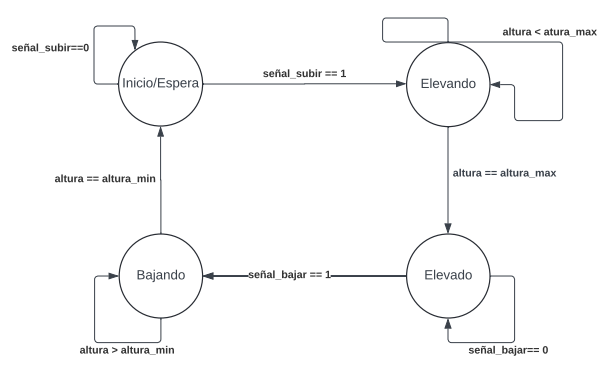

# Sistema controlador para puente levadizo

## Memoria descriptiva
El sistema de control del puente levadizo simula el funcionamiento de un puente que puede elevarse y bajarse para permitir el paso de embarcaciones o vehículos. El puente tiene cuatro estados principales: espera, elevando, elevado y bajando. En el estado espera, el puente está en posición horizontal permitiendo el paso de vehículos; en el estado elevando, el puente está en proceso de levantarse; en el estado elevado, el puente está completamente levantado para el paso de embarcaciones; y en el estado bajando, el puente está en proceso de descender. La máquina de estados gestiona las transiciones entre estos estados en respuesta a las solicitudes de apertura y cierre, así como a eventos de emergencia, asegurando un funcionamiento seguro y eficiente del puente.

### 1. Estado Inicial. Espera.

El puente se encuentra cerrado y los vehiculo pueden pasar sobre el. Su unica transicion posible es recibir la señal de levantamiento para empezar a elevarse. Pasando al estado "Elevando".

### 2. Elevando

El puente tras haber recibido la señal de elevacion, activa los mecanismos fisicos para elevarse hasta alcanzar la altura maxima.

### 3. Elevado

Una vez que se alcanzo la altura maxima, el puente se queda abierto permitiendo el paso de barcos por debajo, hasta recibir nuevamente la señal para cerrarse, y pasar al estado "bajando".

### 4. Bajando

Despues de haber permitido el paso por debajo, el puente comienza a cerrarse mediante activando nuevamente los mecanismos hasta alcanzar la altura minima. Una vez alcanzada la altura minima vuelve a estar en estado de espera, hasta recibir una nueva señal de levantamiento.

## Maquina de estados

A continuacion, se presenta un modelo de maquina de estados para el proyecto.

